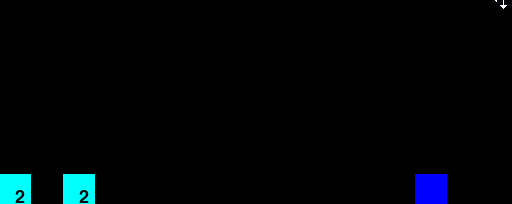

# MARLAnts
### Multi-Agent Reinforcement Learning (Ant Simulator)

This project was inspired by Radhika Nagpal's Ted Talk, "[Taming the Swarm](https://www.youtube.com/watch?v=LHgVR0lzFJc)," in which she introduces the idea that agents working towards local goals can achieve global objectives in a group setting. 

The end goal of this project is to simulate the behaviour of swarm insects. More specifically, the agents should be able to construct some kind of structure as a group, that they would not be able to complete on their own.


### Realization V1



This Pygame + OpenAI Gym environment is a visualization of the construction of a "tower." Here the building blocks are represented in Blue, and the agents in Cyan. The number of blocks an agent is holding is drawn on it. In this setup, the objective is to construct a tower with a height of 5 blocks. Each agent is initialized with 2 blocks. They have two choices at every step: build or move. Their field of vision is the height of the tower in front of them, and they have no explicit way to communicate with one-another. 

Q-Learning was used to iteratively build the policy. 
	
What's going on behind the scenes: a Q-learning algorithm was run for 1000 "episodes" on this simple  environment. The agents (squares) are simply rewarded for making the tower taller. They also incur a small penalty for walking so that they get to building faster. From this they are able to learn the optimal policy of walking until they encounter a tower, then perform the "build" action until it is completed.
 

### Realization V2   *(Currently In Progress)*


Something mildly interesting, and what makes perfect sense in retrospect, is that penalizing the agents when they run out of materials but try to keep building, prevents them from learning the optimal strategy. In V1 they have no sense of how many materials they have, so they don't know if the tower before them was built by themselves or by another agent-- to differentiate they will need information about how many blocks they have already placed. To implement this I am re-writing a lot of code to adapt for scaling agents.

### To try this yourself:
**Dependencies:**   
Python >= 3.5   
Pygame for rendering   
OpenAI Gym   
NumPy  

**Run:**   
The entry point for V1 is tower_q_learning.py. 
Running the script will display the visualization using the previous q-learning table. I have included the optimal example in qtable_1.npy.

The file contains several settings you can adjust:   
Set ```playback``` to False to retrain the agents, and ```episodes``` to adjust the number of episodes this should be run/trained for. The ```fps``` variable controls render fps.

### References

> Nagpal, Radhika. “Taming the Swarm - Collective Artificial Intelligence | .” YouTube, TEDxBermuda, 14 Jan. 2016, https://www.youtube.com/watch?v=LHgVR0lzFJc.

> Ossenkopp, Philip. “Reinforcement Learning – Part 1: Introduction to Q-Learning.” Novatec, 19 June 2019, www.novatec-gmbh.de/en/blog/introduction-to-q-learning.


